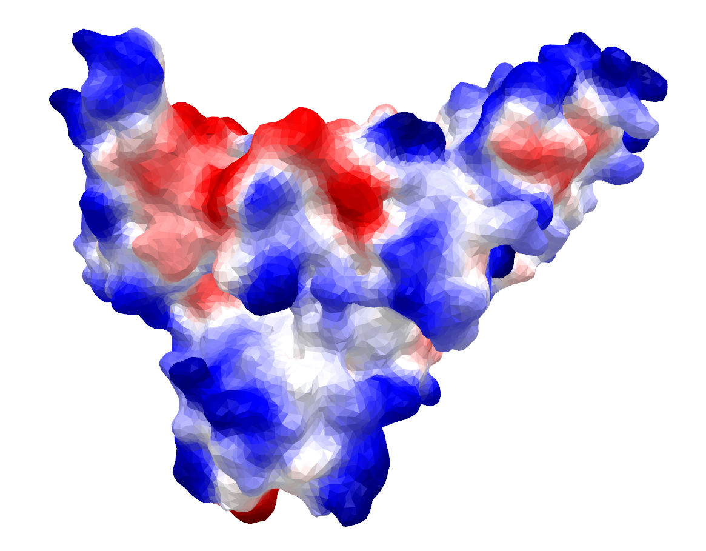

## Introduction
This tutorial documents processing input protein structures (in `.pdb` or `.cif` file format) to generate output `.npz` files containting a mesh representation of the protein and corresponding surface features. We provide a script `pnabind/scripts/generate_protein_meshdata.py` that calls many PNAbind utility functions for this task.

## Configuration File
The file `config.json` contains various processing and output options. The following configuration options are available:

- `"PDB_FILES_PATH"` directory to read in the protein structure data
- `"MESH_FILES_PATH"` directory to write out raw mesh files in `.off` file format
- `"FEATURE_DATA_PATH"` directory to write out processed mesh data in `.npz` file format
- `"ELECTROSTATICS_PATH"` directory to cache output from APBS/TABI-PB to avoid re-running if needed
- `"STRUCTURES_OUTPUT_PATH"` directory to write out cleaned up protein and corresponding binding ligand (if present)
- `"HYDROGENS" [true|false]` keep/add hydrogens during processing
- `"ATOM_DISTANCE_CUTOFF" [float]` heavy atom distance used to indentify binding site residues
- `"MASK_DISTANCE_CUTOFF" [float]` distance used to mask out region at the boundary of the binding site
- `"AREA_MEASURE" ['sesa'|'sasa']` used for defining certain structural features
- `"GRID_SCALE" [float]` a nanoshaper parameter that controls the resolution of the surface mesh
- `"SMOOTH_LABELS" [true|false]` whether to perform a smoothing operation on binding-site labels
- `"SMOOTHING_THRESHOLD" [float]` binding-site patches 
- `"MASK_LABELS" [true|false]` 
- `"MOIETY_LABEL_SET_NAME"` a name of one of the built-in binding ligand class names. Use either "BINARY_STANDARD_RNA", "BINARY_STANDARD_DNA", or "BINARY_STANDARD_NA" for most cases
- `"ELECTROSTATICS_KW"` a dictionary of parameter values for use in APBS calculations. Only needed if computing electrostatic features and one wishes to change the default settings.
- `"BLAST_DB_NAME"` the name of a BLAST database. Only needed if computing MSA features.
- `"BLAST_DB_DIR"` the directory where "BLAST_DB_NAME" is stored. Only needed if computing MSA features.
- `"HHBLITS_DB_NAME"` the name of a HHBlits database. Only needed if computing MSA features.
- `"HHBLITS_DB_DIR"` the directory where "HHBLITS_DB_NAME" is stored. Only needed if computing MSA features.

## Processing for Prediction
To process files for prediction, invoke the script `generate_protein_meshdata.py` with the `-Y` option, which means do not add any labels. To skip MSA and electrostatic features (which are slow to compute), add the options `-ME`. The following invokation will process the provided structure files in the directory `structure_data` with MSA and Electrostatic features included.

```
mkdir mesh_data mesh_files pb_files structure_data_clean
python ../../scripts/generate_protein_meshdata.py structure_files.txt -c config.json -rsAPZY \
--full_chain_sequences chain_sequence_map.json --clean_structures
```

Computing MSA features will require having BLAST/HHBlits configured with the correct databases as described in the Methods section of our paper. The location and name of the databases needs to be added to the configuration file (`config.json`).

The file `chain_sequence_map.json` is used to pass the full sequence of each chain, and is keyed by the name of the protein structure file, followed by the chain identifier. Otherwise, the sequence of each chain is estimated from the residues present in the structure. If residues are missing, the BLAST/HHBlits alignments will be less accurate. It is reccomended to include this file.


## Visualizing mesh data
We can visualize the processed mesh data using the provided script `pnabind/scripts/generate_protein_meshdata.py`. For example, after successfully processing the provided structure data,

```
(pnabind) [jared@fedora generate_mesh_data]$ ../../scripts/visualize_meshdata.py mesh_data/1h4s_A_protein_data.npz 
Enter one of the following:
    l to list features
    m to visualize only the mesh
    c to compare two sets of labels
    q to exit
    t a threshold to visualize predictions with: Y = (P1 >= t)
    a list of data fields, separated by space (e.g. "X1 X2 Y")
:l
X_0 : mean_curvature
X_1 : hks1
X_2 : hks2
X_3 : hks3
X_4 : hks4
X_5 : sap
X_6 : cv_fine
X_7 : cv_medium
X_8 : cv_coarse
...
Y: data field
```

By calling the script and typing "l", we get a list of features. We can select one or more to visualize. In this case, try `X_5`. 




## Processing for Training/Testing
Processing for training/testing means including binding-site or binding-class labels. Some additional files are provided which can be used for fine-tuning how labels are created.

### Segmentation
`masked_chains.json` is a list of chains per protein structure file that will be masked. Masking means that the vertices corresponing to these chains will not be used in back-prop (but they ARE used in the forward pass). This is useful when we are processing assemblies, but only want to back-prop on the target chain in a train/test set. In the provided data, only one protein chain per structure is included, so `masked_chains.json` contains an empty list for each structure.

`binding_residue_ids.json` an explicit list of residues to be labeled as binding-sites. Useful if binding labels have been identified previously, or if ligands (i.e., DNA/RNA) are not present in the input structure file. Otherwise, with the `-y` option the processing script will attempt to label binding site residues based on the type of ligand present in the input structure file, in conjuction with the `MOIETY_LABEL_SET_NAME` configuration option or `-m`, or `-l` options.

A typical segmentation processing run might look like:

```
python ../../scripts/generate_protein_meshdata.py structure_files.txt -c config.json -rsAPZ -y Y \
--full_chain_sequences chain_sequence_map.json --mask_chains masked_chains.json \
--residue_ids binding_residue_ids.json --clean_structures
```

### Classification
For classification, we only need a single integer label per mesh. For this, we provide a post-processing script `set_class_label.py` to add this global label to the generated datafiles.

A typical classification processing run might look like:
```
python ../../scripts/generate_protein_meshdata.py structure_files.txt -c config.json -rsAPZ  --full_chain_sequences chain_sequence_map.json --clean_structures -o datafiles.txt
```
followed by

```
python set_class_label.py datafiles.txt binding_function.csv binding_function_label_map.json -p mesh_data -y 'Ybind'
```

The file `binding_function.csv` associates the structure to a binding function. This file would typically be derived from an external database like Uniprot. The file `binding_function_label_map.json` maps the binding function to an integer class label. The `-y` argument specifies the name of the key where the label will be stored in the `.npz` mesh datafile.
